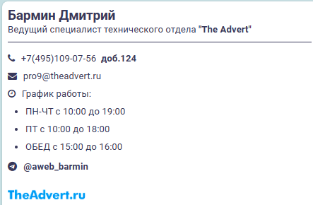

# signature_mail
Подписи AWEB и TheAdvert

<body id="page-top">
    

        <nav class="navbar navbar-dark align-items-start sidebar sidebar-dark accordion bg-gradient-primary p-0">
            

                <ul class="navbar-nav text-light" id="accordionSidebar" style="height: 118px;margin-top: 20px;">
                    <li class="nav-item"><a class="nav-link" href="#подготовка-подписи"><i class="fa fa-envelope-o" style="padding-right: 10px;"></i><strong>Подпись</strong> </a></li>
                    <li class="nav-item"><a class="nav-link" href="#настройка-подписи-дляthunderbird"><i class="fa fa-envelope-o" style="padding-right: 10px;"></i><strong>Thunderbird</strong></a></li>
                </ul>
            

        </nav>
        

            

                

                    

                        <h3 class="text-dark mb-0" style="padding-top: 24px;">Подготовка подписи&nbsp; </h3>
                    

                

                
<strong>1</strong>. Скачиваем оба файла - <a href="download/signature_html.zip">скачать</a> Распаковываем&nbsp;signature_html.zip Открываем файлы блокнотом, но я рекомендую текстовый редактор:&nbsp;<a href="https://code.visualstudio.com/download" target="_blank">Visual Studio Code</a>, либо&nbsp;<a href="https://www.sublimetext.com/3" target="_blank">Sublime Text</a>&nbsp; Далее нужно заменить данные в файлах.&nbsp;  <em>Примеры как будут выглядеть&nbsp;</em><a href="#AWEB" target="_blank"><em>AWEB</em></a><em>&nbsp;и&nbsp;</em><a href="#TheAdvert" target="_blank"><em>TheAdvert</em></a>

                
<strong>2</strong>. Редактируем ФИ и должность (всё что подчеркнуто находится внутри &gt;&lt; <strong><em>Важно:</em></strong><em> не удаляйте между фамилией и именем</em> - &amp;nbsp;

                
Меняем добавочный

                
Меняем почту. Обратите внимание, чтобы почта была кликабельная нужно записать после mailto: ,  а чтобы отображался текст самой почты, нужно записать между &gt;&lt;

                
Меняем график работы

                
Меняем телеграм. в href между "" вставляем ссылку на рабочий ТГ, а между &gt;&lt; пишем свой id.

                
Если нужно убрать ТГ, то просто скрываем часть кода. Перед &lt;tr&gt; пишем &lt;!-- а после &lt;/tr&gt; пишем --&gt;&nbsp;

                
Сохраняем результат shift+ctrl+s - <strong>готово</strong> <strong>Обязательно сохраните файлы в ту часть диска, от куда не сможете по ошибке удалить,&nbsp;например в документы.</strong>

            
<a class="border rounded d-inline scroll-to-top" href="#page-top"><i class="fas fa-angle-up"></i></a>
        

    

       

            

                

                    

                        <h3 class="text-dark mb-0" style="padding-top: 24px;">Настройка подписи для&nbsp;Thunderbird</h3>
                    

                

                
<strong>1. </strong>Открывается настройки: Три горизонтальные полоски в правом верхнем углу - "Настройки".

                
<strong>2. </strong>Открываем "Параметры учётной записи"

                
<strong>3. </strong>Далее выбираем учётную&nbsp;запись, активируем "вставить подпись из файла", нажимаем Выбрать и берём файл .html куда закачали.

                
<strong>Всё готово!</strong>

                

            
    
       

    

           
AWEB
           
TheAdvert

</body>
